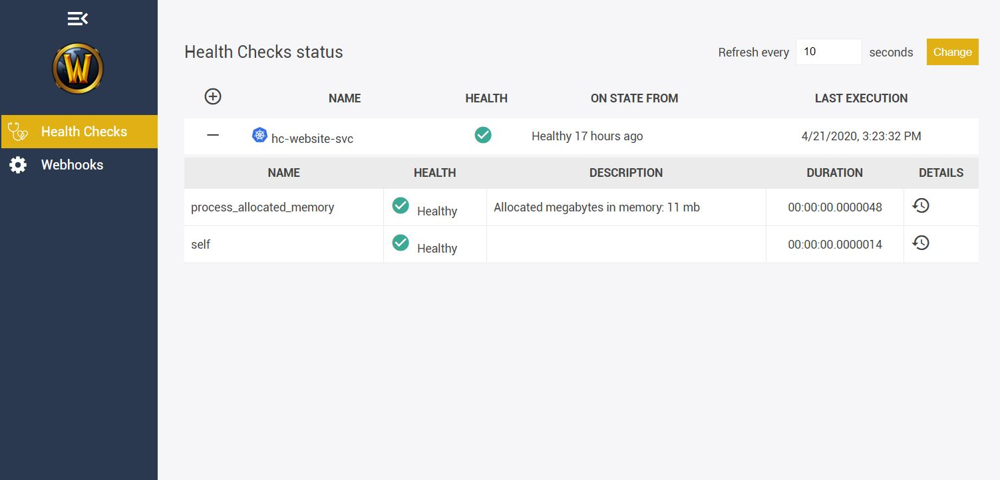
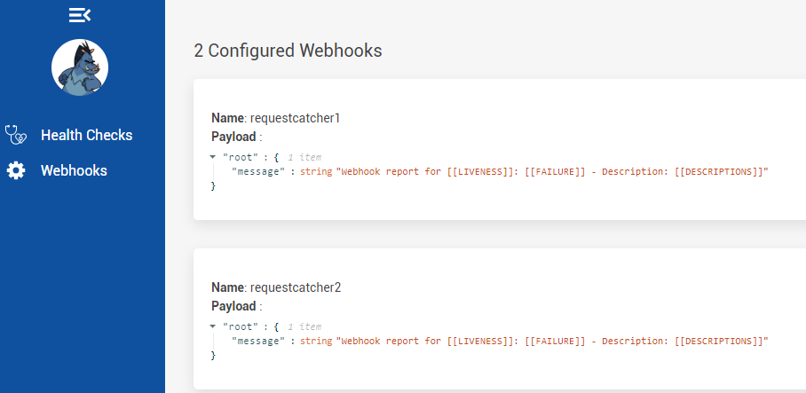

# Health Checks Kubernetes Operator

This repository, offers a Kubernetes Operator that automatically deploys and configures the HealthChecks UI in k8s and also monitors labeled services that expose healthchecks in a given namespace.

The operator also has a namespaced service watcher that can detect new services and report them back to the UI and also tracks services modifications and removals so the UI always represents the latest desired state.

## Installing HealthChecks Operator

### Intalling with the installer tool

We offer a installer tool for windows and linux, that will install all necessary resources to have your operator up and running in seconds in the healthchecks namespace.

You can download the differente releases from this links:

- [Windows Release](https://github.com/Xabaril/AspNetCore.Diagnostics.HealthChecks/raw/master/deploy/operator/installer/releases/operator-installer-win.exe)
- [Linux Release](https://github.com/Xabaril/AspNetCore.Diagnostics.HealthChecks/raw/master/deploy/operator/installer/releases/operator-installer-linux)

Note: If you execute the tool with --delete parameters, a resource cleanup will be triggered and all the operator related resources including the crd will be removed.

### Installing from definition files

You can deploy healthchecks operator in your cluster by cloning the repository and applying the yaml definition files:

- Apply the custom resource definition: [healthcheck-crd](https://github.com/Xabaril/AspNetCore.Diagnostics.HealthChecks/blob/master/deploy/operator/crd/healthcheck-crd.yaml)

  `kubectl apply -f deploy/operator/crd/healthcheck-crd.yaml`

- Apply the rest of definition yamls

  `kubectl apply -f ./deploy/operator`

## Creating a HealthCheck Resource

The [HealthCheck operator definition](https://github.com/Xabaril/AspNetCore.Diagnostics.HealthChecks/blob/master/deploy/operator/crd/healthcheck-crd.yaml), has the following fields to be configured:

### Required fields

| Field         | Description                                                                        |
| ------------- | :--------------------------------------------------------------------------------- |
| name          | Name of the healthcheck resource                                                   |
| scope         | Cluster / Namespaced                                                               |
| servicesLabel | The label the operator service watcher will use to detected healthchecks endpoints |

### Scope definition (Cluster or Namespaced)

The scope field (Cluster or Namespaced) is mandatory and will specify to the operator whether it should watch for healthchecks services in the
same namespace where the UI resource is created or watch to all services in all namespaces.

If you wan't to have different UI's for different namespaced services you should use **Namespaced**

If you wan't to have a single UI that monitors all the healthchecks from the cluster you should use **Cluster**

Note: The UI resources created by the operator (deployment, service, configmap, secret, etc) will always be created in the metadata specified namespace.

### Optional fields

| Field                 | Description                                                               | Default                                              |
| --------------------- | :------------------------------------------------------------------------ | ---------------------------------------------------- |
| serviceType           | How the UI should be published (ClusterIP, LoadBalancer or NodePort)      | ClusterIP                                            |
| portNumber            | What port will be used to expose the UI service                           | 80                                                   |
| uiPath                | Location where the UI frontend will be served                             | /healthchecks                                        |
| uiApiPath             | Location where the UI backend API will be served                          | UI defaults                                          |
| uiResourcesPath       | Location where the UI static files resources will be served               | UI defaults                                          |
| uiWebhooksPath        | Location where the Webhooks api                                           | UI defaults                                          |
| uiNoRelativePaths     | Disable UI front-end relative paths                                       | false                                                |
| healthChecksPath      | Path where the UI will collect health from endpoints                      | /health (Can be overriden with a service annotation) |
| healthChecksScheme    | Scheme to be used to collect health from endpoints                        | http (Can be overriden with a service annotation)    |
| image                 | Image to be used by the UI                                                | xabarilcoding/healthchecksui:latest                  |
| imagePullPolicy       | Deployment image pull policy                                              | Always                                               |
| stylesheetContent     | css content used to brand the UI                                          | none                                                 |
| serviceAnnotations    | name / value array to use custom annotations in UI service                | none                                                 |
| deploymentAnnotations | name / value array to use custom annotations in UI Deployment             | none                                                 |
| webhooks              | webhook array object (name, uri, payload and restoredPayload)             | none                                                 |
| tolerations           | toleration array object (key, operator, value, effect and seconds)        | none                                                 |

## Sample HealthChecks Operator Tutorial

Let's start by creating a demo namespace:

`kubectl create ns lande`

And then, create a healthchecks-ui.yaml file with the following contents:

```yaml
apiVersion: "aspnetcore.ui/v1"
kind: HealthCheck
metadata:
  name: healthchecks-ui
  namespace: demo
spec:
  name: healthchecks-ui
  scope: Namespaced #The UI will be created at specified namespace (demo) and will watch healthchecks services in demo namespace only
  #scope: Cluster The UI will be created at specified namespace (demo) but will watch healthcheck services across all namespaces
  servicesLabel: HealthChecks
  serviceType: LoadBalancer
  stylesheetContent: >
    :root {    
      --primaryColor: #2a3950;
      --secondaryColor: #f4f4f4;  
      --bgMenuActive: #e1b015;
      --bgButton: #e1b015;
      --logoImageUrl: url('https://upload.wikimedia.org/wikipedia/commons/thumb/e/eb/WoW_icon.svg/1200px-WoW_icon.svg.png');
      --bgAside: var(--primaryColor);   
    }
  serviceAnnotations:
    - name: service.beta.kubernetes.io/azure-load-balancer-internal
      value: "true"
```

Let's apply the HealthCheck definition with the created file:

`kubectl apply -f healthchecks-ui.yaml`

You can now check your created HealthCheck resource using:

`kubectl get healthcheck -n demo`

### Operator controller

Once you apply a HealthCheck kind resource, the operator will automatically create some resources in the namespace. The UI deployment and service to expose the dashboard, a secret that enables secure communication from the operator to the UI service, and an optional configmap volume source depending if you configured the stylesheetContent branding.

All this resources are created using OwnerReferences so that means if you delete the HealthCheck resource, all the child resources will be automatically purged with it.

The operator also starts services watchers per namespace that will monitor creation, modification of labels and annotations and also services themselves. If a monitored application is added or removed and has the HealthChecks label annotation, the UI will automatically react to this events.

## Deploying an Application with HealthChecks to be monitored automatically

The next step is creating an AspNetCore core uses some HealthChecks. We are going to use a sample app that is already deployed in dockerhub (carloslanderas/hc-website) using the following code:

```csharp
using HealthChecks.UI.Client;
using Microsoft.AspNetCore.Builder;
using Microsoft.AspNetCore.Diagnostics.HealthChecks;
using Microsoft.AspNetCore.Hosting;
using Microsoft.Extensions.Configuration;
using Microsoft.Extensions.DependencyInjection;
using Microsoft.Extensions.Diagnostics.HealthChecks;

namespace hc_website
{
    public class Startup
    {
        public Startup(IConfiguration configuration)
        {
            Configuration = configuration;
        }

        public IConfiguration Configuration { get; }

        // This method gets called by the runtime. Use this method to add services to the container.
        public void ConfigureServices(IServiceCollection services)
        {
            services
                .AddRouting()
                .AddHealthChecks()
                .AddProcessAllocatedMemoryHealthCheck(maximumMegabytesAllocated: 50)
                .AddCheck("self", () => HealthCheckResult.Healthy());
        }

        // This method gets called by the runtime. Use this method to configure the HTTP request pipeline.
        public void Configure(IApplicationBuilder app, IWebHostEnvironment env)
        {
            app.UseRouting();
            app.UseEndpoints(endpoints =>
            {
                endpoints.MapHealthChecks("/health", new HealthCheckOptions
                {
                    Predicate = r => true,
                    ResponseWriter = UIResponseWriter.WriteHealthCheckUIResponse
                });
            });
        }
    }
}

```

The next step, is deploying this application using a deployment yaml definition like this:

```yaml
apiVersion: extensions/v1beta1
kind: Deployment
metadata:
  name: hc-website-deploy
  namespace: demo
  labels:
    app: hc-website
spec:
  selector:
    matchLabels:
      app: hc-website
  replicas: 1
  template:
    metadata:
      labels:
        app: hc-website
    spec:
      containers:
        - name: hc-website
          image: carloslanderas/hc-website
          imagePullPolicy: Always
          ports:
            - name: http
              containerPort: 80
          env:
            - name: Logging__LogLevel__Default
              value: Debug
            - name: Logging__LogLevel__Microsoft
              value: Warning
            - name: Logging__LogLevel__hc_website
              value: Debug
---
kind: Service
apiVersion: v1
metadata:
  name: hc-website-svc
  namespace: demo
  labels:
    HealthChecks: enabled
spec:
  selector:
    app: hc-website
  type: ClusterIP
  ports:
    - name: http
      port: 80
      targetPort: 80
```

Note the HealthChecks : enabled label to tell the operator this is a healthchecked application:

```yaml
labels:
  HealthChecks: enabled
```

Create a `deployment.yaml` file with above contents and apply it:

`kubectl apply -f deployment.yaml`

## Service Annotations

You can use `HealthChecksPath` and `HealthChecksScheme` annotations in HealthChecks services to override the default Path and Scheme crd definition.

## Accessing the UI service

Once you applied the [HealthCheck](#Sample-HealthCheck-definition) definition, the operator has automatically created some resources to setup your UI service and you can now access the healthchecks dashboard after inspecting it's address:

`kubectl get svc -n demo`

NAME TYPE CLUSTER-IP EXTERNAL-IP PORT(S) AGE

hc-website-svc ClusterIP 10.0.145.224 <none> 80/TCP 16h

healthchecks-ui-svc LoadBalancer 10.0.20.73 **51.138.24.168** 80:31343/TCP 16h

Your UI endpoint will be listening in http://51.138.24.168/healthchecks and the labeled service should appear automatically.



## Webhooks Configuration

You can configure webhook notifications by using the webhooks yaml array element. Each webhook definition requires a name, a uri and unhealthy notification and restore payloads.

The UI hosted service will automatically trigger configured webhooks with the defined `payload` whenever a healthcheck reports unhealthy and will use `restoredPayload` to notify the healthcheck is up and running again.

```yaml
apiVersion: "aspnetcore.ui/v1"
kind: HealthCheck
metadata:
  name: healthchecks-ui
spec:
  name: healthchecks-ui
  servicesLabel: HealthChecks
  stylesheetContent: >
    :root {
      --primaryColor: #0f519f;
      --secondaryColor: #f4f4f4;
      --bgMenuActive: #0f519f;
      --bgButton: #0f519f;
      --bgAside: var(--primaryColor);
    }
  webhooks:
    - name: requestcatcher1
      uri: https://healthchecks.requestcatcher.com
      payload: '{ message: "Webhook report for [[LIVENESS]]: [[FAILURE]] - Description: [[DESCRIPTIONS]]"}'
      restoredPayload: '{ message: "[[LIVENESS]] is back to life"}'
    - name: requestcatcher2
      uri: https://healthchecks2.requestcatcher.com
      payload: '{ message: "Webhook report for [[LIVENESS]]: [[FAILURE]] - Description: [[DESCRIPTIONS]]"}'
      restoredPayload: '{ message: "[[LIVENESS]] is back to life"}'
```

Once your webhooks are specified in the yaml definition, you can check if they are correctly configured in the UI webhooks section:


