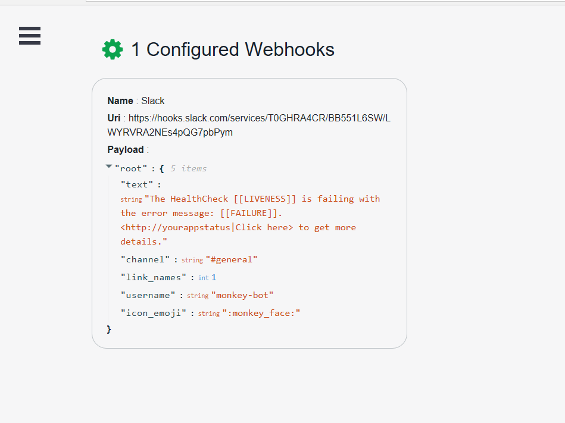

# Failure notification WebHooks

## Microsoft Teams



If you want to send failure notifications to Microsoft Teams the payload to be used is:

```json
{
  "@context": "http://schema.org/extensions",
  "@type": "MessageCard",
  "themeColor": "0072C6",
  "title": "[[LIVENESS]] has failed!",
  "text": "[[FAILURE]]. Click **Learn More** to go to BeatPulseUI!",
  "potentialAction": [
    {
      "@type": "OpenUri",
      "name": "Learn More",
      "targets": [
        { "os": "default", "uri": "http://localhost:52665/beatpulse-ui" }
      ]
    }
  ]
}
```

> HealthCheckUI replace automatically [[LIVENESS]] and [[FAILURE]] bookmarks.

You must escape the json before setting the **Payload** property in the configuration file:

```json
{
  "BeatPulse-UI": {
    "HealthChecks": [
      {
        "Name": "HTTP-Api-Basic",
        "Uri": "http://localhost:6457/health"
      }
    ],
    "Webhooks": [
      {
        "Name": "Teams",
        "Uri": "https://outlook.office.com/webhook/...",
        "Payload": "{\r\n  \"@context\": \"http://schema.org/extensions\",\r\n  \"@type\": \"MessageCard\",\r\n  \"themeColor\": \"0072C6\",\r\n  \"title\": \"[[LIVENESS]] has failed!\",\r\n  \"text\": \"[[FAILURE]] Click **Learn More** to go to BeatPulseUI Portal\",\r\n  \"potentialAction\": [\r\n    {\r\n      \"@type\": \"OpenUri\",\r\n      \"name\": \"Lear More\",\r\n      \"targets\": [\r\n        { \"os\": \"default\", \"uri\": \"http://localhost:52665/beatpulse-ui\" }\r\n      ]\r\n    }\r\n  ]\r\n}",
        "RestoredPayload": "{\"text\":\"The HealthCheck [[LIVENESS]] is recovered. All is up and running\",\"channel\":\"#general\",\"link_names\": 1,\"username\":\"monkey-bot\",\"icon_emoji\":\":monkey_face"
      }
    ],
    "EvaluationTimeOnSeconds": 10
  }
}
```

## Azure Functions

You can use [Azure Functions](https://docs.microsoft.com/en-us/azure/azure-functions/) to receive *HealthCheckUI* notifications and perform any action. 

Next samples show AF integration with Twilio to send SMS / SendGrid for HealthCheckUI failure notifications.

```c#
#r "Twilio.API"
#r "Newtonsoft.Json"

using System;
using System.Net;
using Twilio;
using Newtonsoft.Json.Linq;

public static async Task Run(HttpRequestMessage req, IAsyncCollector<SMSMessage> message, TraceWriter log)

{
    string jsonContent = await req.Content.ReadAsStringAsync();
    dynamic payload = JObject.Parse(jsonContent);

    log.Info($"Notifying a new failure notification to configured phone number");

    var sms = new SMSMessage();
    sms.Body = $"The healthcheck {payload.liveness} is failing with message {payload.message}";
    await message.AddAsync(sms);
}

```

```c# 
#r "SendGrid"
using System;
using SendGrid.Helpers.Mail;

public static async Task Run(HttpRequestMessage req, IAsyncCollector<Mail> message, TraceWriter log)
{
    const string targetEmail = "youemail@host.com";

    string jsonContent = await req.Content.ReadAsStringAsync();
    dynamic payload = JObject.Parse(jsonContent);

    log.Info($"Notifying a new failure notification to configured phone number");

    var mail = new Mail
    {
        Subject = "Beatpulse Failure Notification"
    };

    var personalization = new Personalization();
    personalization.AddTo(new Email(targetEmail));

    Content content = new Content
    {
        Type = "text/plain",
        Value = $"The HealthCheck {payload.liveness} is failing with message {payload.message}"
    };

    mail.AddContent(content);
    mail.AddPersonalization(personalization);

    await message.AddAsync(mail);
}
```

```json
{
  "HealthChecks-UI": {
    "HealthChecks": [
      {
        "Name": "HTTP-Api-Basic",
        "Uri": "http://localhost:6457/health"
      }
    ],
    "Webhooks": [
      {
        "Name": "AzureFunctions",
        "Uri": "https://notifier.azurewebsites.net/api/sample?code=...==",
        "Payload": "{\"HealthCheck\": \"[[LIVENESS]]\",\"message\": \"[[FAILURE]]\"}"
      }
    ],
    "EvaluationTimeOnSeconds": 10
  }
}
```

## Slack

If you want to send HealthCheck failure notifications to Slack channel the payload to be used follow the rules described [here](https://api.slack.com/incoming-webhooks).

Next **json** is a payload sample for Slack web hook integration:

```json
{
  "text": "The HealthCheck [[LIVENESS]] is failing with the error message [[FAILURE]]. <http://yourappstatus|Click here> to get more details",
  "channel": "#general",
  "link_names": 1,
  "username": "monkey-bot",
  "icon_emoji": ":monkey_face:"
}
```

And the HealthChecksUI configuration:

```json
{
  "HealthChecks-UI": {
    "HealthChecks": [
      {
        "Name": "HTTP-Api-Basic",
        "Uri": "http://localhost:6457/health"
      }
    ],
    "Webhooks": [
      {
        "Name": "Slack",
        "Uri": "https://hooks.slack.com/services/.../...",
        "Payload": "{\"text\":\"The HealthCheck [[LIVENESS]] is failing with the error message [[FAILURE]]. <http://yourappstatus|Click here> to get more details.\",\"channel\":\"#general\",\"link_names\": 1,\"username\":\"monkey-bot\",\"icon_emoji\":\":monkey_face:\"}",
        "RestoredPayload": "{\"text\":\"The HealthCheck [[LIVENESS]] is recovered. All is up and running\",\"channel\":\"#general\",\"link_names\": 1,\"username\":\"monkey-bot\",\"icon_emoji\":\":monkey_face"
      }
    ],
    "EvaluationTimeOnSeconds": 10
  }
}
```

> Review [Slack Documentation](https://slack.com/) to get more information about creating incoming web hook integrations.